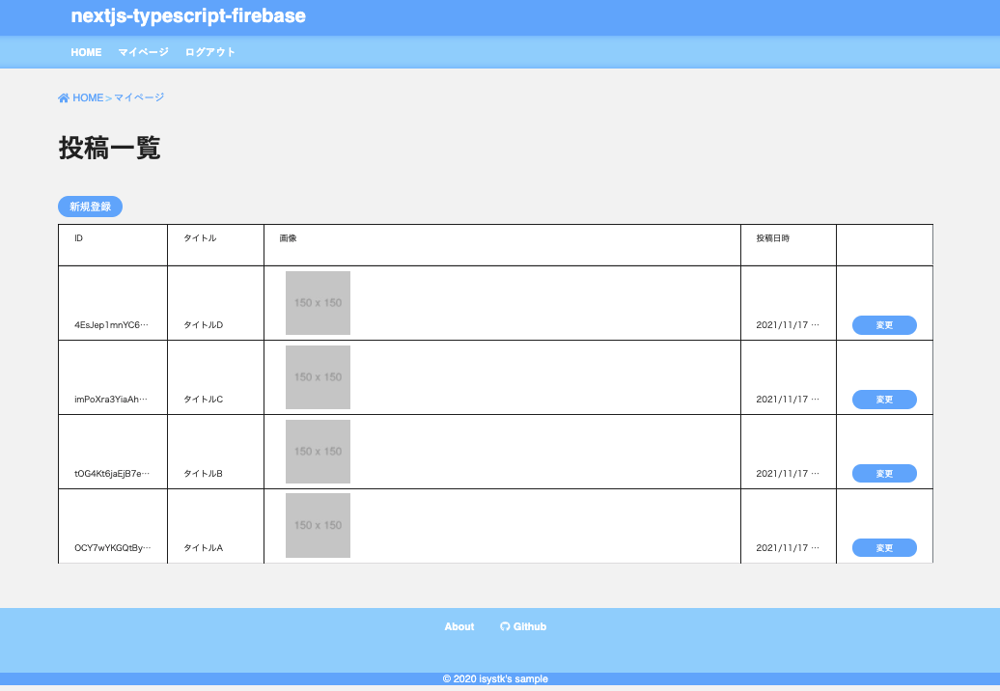
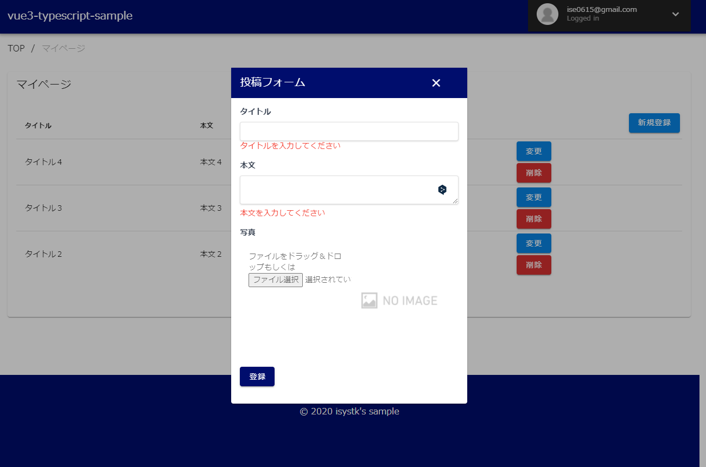

🌙 amplify-nuxt3-sample
====

[](https://circleci.com/gh/isystk/amplify-nuxt3-sample/tree/master)


## 📗 プロジェクトの概要

AWS Amplify の学習用サンプルアプリケーションです。


### 利用している技術

- Nuxt.js 3
- Typescript
- Vuetify
- TailwindCSS & Sass
- Amplify (Cognito/AppSync/DynamoDB)
- GraghQL
- Storybook

## 🌐 Demo
https://dev.dl83z1vvxx26n.amplifyapp.com






## 🔧  AWS クライド上にamplifyの環境を構築する
```text
$ rm -Rf amplify
$ amplify init
? Initialize the project with the above configuration? No
? Enter a name for the environment dev
? Choose your default editor: IntelliJ IDEA
? Choose the type of app that you're building javascript
Please tell us about your project
? What javascript framework are you using react
? Source Directory Path:  src
? Distribution Directory Path: .output/public
? Build Command:  npm run build
? Start Command: npm run start
Using default provider  awscloudformation
? Select the authentication method you want to use: (Use arrow keys)
❯ AWS profile 
  AWS access keys (node:42574) [DEP0128] DeprecationWarning: Invalid 'main' field in '/Users/iseyoshitaka/.nodebrew/node/v16.13.1/lib/node_modules/@aws-amplify/cli/node_modules/cloudform/package.json' of 'packages/cloudform/index.js
? Select the authentication method you want to use: AWS profile

# init で作成した環境を AWS から一括で削除したい場合
$ amplify delete
```

## 📦 ディレクトリ構造

```
.
├── LICENSE
├── README.md
├── amplify
│   ├── README.md
│   ├── backend
│   ├── cli.json
│   ├── hooks
│   └── team-provider-info.json
├── node_modules
├── nuxt.config.ts
├── package.json
├── src
│   ├── __tests__
│   ├── app.vue
│   ├── assets
│   ├── aws-exports.js
│   ├── components
│   ├── constants
│   ├── layouts
│   ├── locales
│   ├── middleware
│   ├── mixins
│   ├── pages
│   ├── plugins
│   ├── public
│   ├── services
│   ├── store
│   └── stories
├── tailwind.config.js
├── tsconfig.jest.json
├── tsconfig.json
└── yarn.lock
```


## 🖊️amplify の利用方法

```shell
# amplify コマンドをインストールする
$ npm install -g @aws-amplify/cli
$ amplify -v
8.3.1

# amplify を利用する為の設定
$ amplify configure
? user name:  amplify-lBpzV

# AWS から amplify の状態をローカルに取り込む
$ amplify pull --appId dl83z1vvxx26n --envName dev

# ローカル の状態を AWS の amplify へ反映する
$ amplify push

# 最新モジュールをホスティング環境にデプロイする
$ amplify publish
```

## 💬 使い方
```text
# edit nuxt.config.ts
// global: {}, // ← yarn dev するときはコメントアウトを外して下さい
# module install
yarn
# app run
yarn dev
```

## 🎨 参考

| プロジェクト| 概要|
| :---------------------------------------| :-------------------------------|
| [Nuxt3 Docs](https://v3.nuxtjs.org/guide/concepts/introduction)| Nuxt3 Docs |
| [Vuetify 3 Beta](https://next.vuetifyjs.com/en/getting-started/installation/)| Vuetify 3 Beta |
| [AWS Amplify　はじめてみる編](https://qiita.com/t_okkan/items/38aca98993bf06598af6)| AWS Amplify　はじめてみる編 |
| [Material Design Icons](https://pictogrammers.github.io/@mdi/font/2.0.46/)| Material Design Icons |
| [Tailwind CSS](https://tailwindcss.com/docs/installation)| Tailwind CSS |
| [vee-validate](https://vee-validate.logaretm.com/v4/guide/components)| vee-validate |
| [husky v6 のインストール方法と使い方。lint-staged も導入して、品質を保とう](https://fwywd.com/tech/husky-setup)| husky v6 のインストール方法と使い方。lint-staged も導入して、品質を保とう |


## 🎫 Licence

[MIT](https://github.com/isystk/amplify-nuxt3-sample/blob/master/LICENSE)

## 👀 Author

[isystk](https://github.com/isystk)

